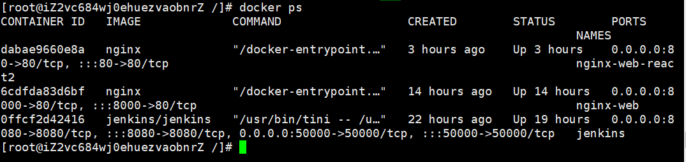
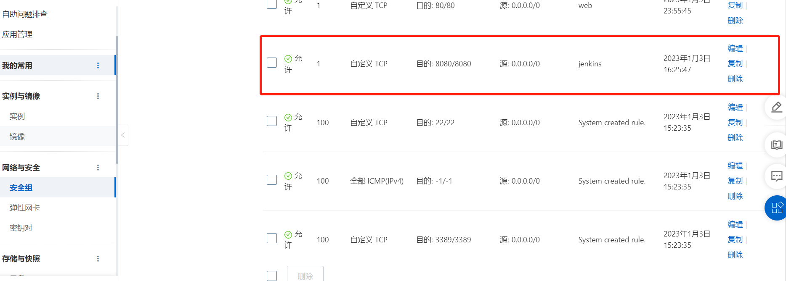
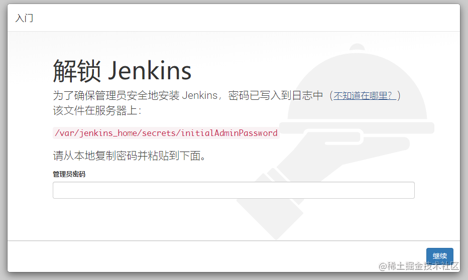
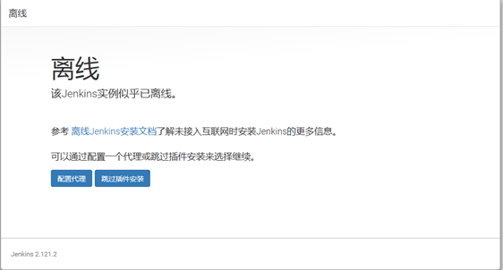
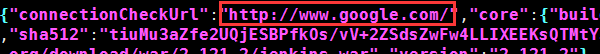
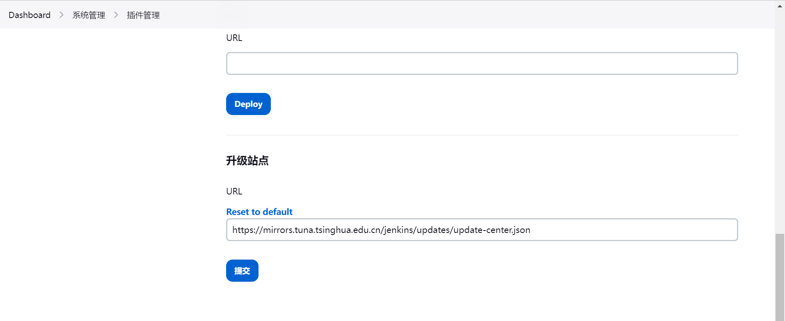
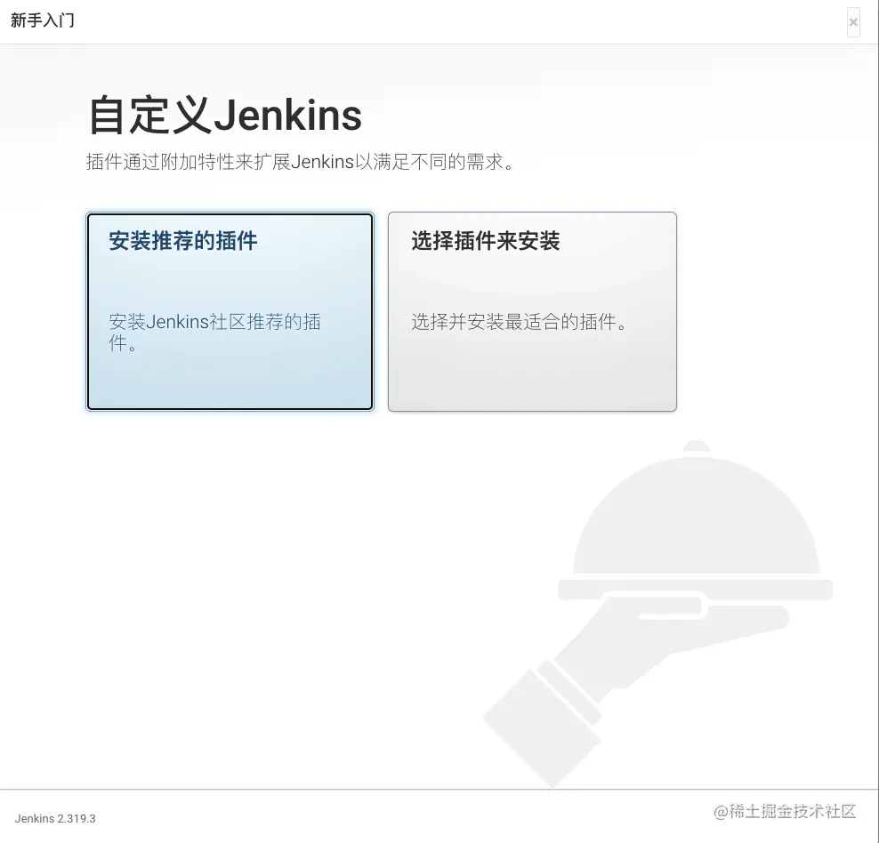

# Docker安装Jenkins，Nginx，实现前端项目自动化构建

## 安装 Docker
```shell
// 安装
curl -fsSL get.docker.com -o get-docker.sh
sh get-docker.sh
// 启动Docker服务
systemctl start docker
// 开机默认启动
systemctl enable docker
```
执行一下`docker -v`，可以用来查看 Docker 安装的版本信息。也可以帮助我们查看 docker 的安装状态；如果正常展示版本信息，代表 Docker 已经安装成功。

通过`docker ps`查看容器状态。

## 安装 Jenkins

### 拉取 jenkins 镜像
使用 `docker pull` 命令拉取镜像
```shell
docker pull jenkins/jenkins
```
### 运行容器
```shell
docker run -d --name jenkins -p 8080:8080 -p 50000:50000 jenkins/jenkins
```
> 参数说明
> - --name 定义一个容器的名字，如果没有指定，那么会自动生成一个随机数字符串当做UUID
> - -d 标识是让 docker 容器在后台运行
> - -p 9000:8080 端口映射，将宿主机9000端口映射到容器8080端口
> - -p 50000:50000 50000端口是基于JNLP的Jenkins代理（slave）通过TCP与 Jenkins master 进行通信的端口。

启动后可以通过 `docker ps` 来查看服务情况。


**注意：**
* 在云服务器的防火墙里打开8080端口才能访问。
* 然后通过服务器ip：8080端口就可以访问我们的 jenkins 服务

> 例如在阿里云中进行安全组配置


### 配置Jenkins

通过 `http://<ipaddress>:8080` 访问 Jenkins 界面



由于我们是用 docker 安装的，所以密码会被存储到容器中。
管理员初始密码被放到了 `/var/jenkins_home/secrets/initialAdminPassword` 文件中。

```shell
docker exec -it jenkins bash
```
进入容器查看密码，然后再 jenkins 页面中输入密码
```shell
cat /var/jenkins_home/secrets/initialAdminPassword
```
#### 问题：
再完成上一步之后，大部分情况下会出现 **您的 Jenkins 已离线**


> 原因是jenkins在下载插件之前会先检查网络连接，其会读取这个文件中的网址。默认是：
> 访问谷歌，肯定访问不了，所以将图下的google改为www.baidu.com即可，更改完重启服务。


首先我们找的 `default.json` 的位置，先进入容器`docker exec -it jenkins bash`，这个文件存放在了 `/var/jenkins_home/updates/` 目录下

docker 中的文件无法直接修改
1. 方式一：可以使用 `yum -y install vim` 或者 `apt-get install vim` 命令安装。
然后再通过vim进行修改，**但这种方法不推荐**
```shell
vim default.json
```
2. 方式二：把容器里面的文件拷贝到本机进行修改，然后再拷贝回去
命令如下
```shell
docker cp [容器名字]:[具体文件地址] [想要拷贝到本地的目标地址]
#例子
docker cp redis:/test/cptest.txt ./
```
如果使用这种方式，命令如下：
```shell
docker cp jenkins:/var/jenkins_home/updates/default.json /root/var/tmp
```
然后，我们把修改后的 `default.json` 拷贝回去。
```shell
docker cp /root/var/tmp/default.json jenkins:/var/jenkins_home/updates 
```

最后一步，打开 `http://<ip>:8080/pluginManager/advanced` 页面滚动到最底部 Update Site 的 URL 为：
* https://mirrors.tuna.tsinghua.edu.cn/jenkins/updates/update-center.json

该地址为 [清华大学开源软件镜像站](https://mirrors.tuna.tsinghua.edu.cn/jenkins/plugins/ "清华大学开源软件镜像站")


如果一切正常的话，就可以正常安装插件了


如果上述步骤出问题，也可以跳过插件安装，在里面手动下载，然后在 Jenkins 的插件管理里面手动安装。


