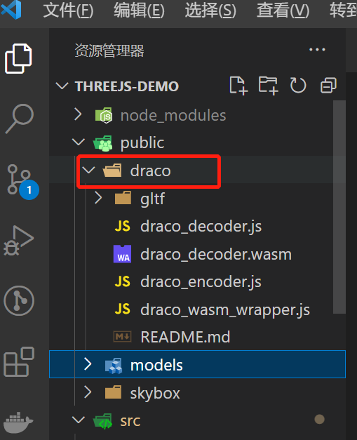

## 前言
本文需要对 threejs 的一些基本概念和 api 有一定了解。  

如果对threejs这部分还不了解的可以看下官方文档和一些中文文档进行学习。

> 官方文档地址：https://threejs.org/
>
> 中文文档地址：http://www.webgl3d.cn/pages/aac9ab/

本文主要主要讲述对 threejs 的一些 api 进行基本的封装，在 vue3 项目中来实现一个可视化的3d项目。包含了一些常用的功能，**场景、灯光、摄像机初始化，模型、天空盒的加载，以及鼠标点击和悬浮的事件交互。**

项目截图：


Github 地址：
https://github.com/fh332393900/threejs-demo

## 基础功能

## 1.场景 Viewer 类

首先我们第一步需要初始化场景、摄像机、渲染器、灯光等。这些功能只需要加载一次，我们都放到 **Viewer** 类中可以分离关注点，在业务代码中就不需要关注这一部分逻辑。业务代码中我们只需要关注数据与交互即可。

### 1.1 初始化场景和摄像机

```js
private initScene() {
  this.scene = new Scene();
}

private initCamera() {
  // 渲染相机
  this.camera = new PerspectiveCamera(25, window.innerWidth / window.innerHeight, 1, 2000);
  //设置相机位置
  this.camera.position.set(4, 2, -3);
  //设置相机方向
  this.camera.lookAt(0, 0, 0);
}
```

### 1.2 初始化摄像机控制器

```js
private initControl() {
  this.controls = new OrbitControls(
    this.camera as Camera,
    this.renderer?.domElement
  );
  this.controls.enableDamping = false;
  this.controls.screenSpacePanning = false; // 定义平移时如何平移相机的位置 控制不上下移动
  this.controls.minDistance = 2;
  this.controls.maxDistance = 1000;
  this.controls.addEventListener('change', ()=>{
    this.renderer.render(this.scene, this.camera);
  });
}
```

### 1.3 初始化灯光

这里放了一个环境灯光和平行灯光，这里是写在 Viewer 类里面的，如果想灵活一点，也可以抽象出去。

```js
private initLight() {
  const ambient = new AmbientLight(0xffffff, 0.6);
  this.scene.add(ambient);

  const light = new THREE.DirectionalLight( 0xffffff );
  light.position.set( 0, 200, 100 );
  light.castShadow = true;

  light.shadow.camera.top = 180;
  light.shadow.camera.bottom = -100;
  light.shadow.camera.left = -120;
  light.shadow.camera.right = 400;
  light.shadow.camera.near = 0.1;
  light.shadow.camera.far = 400;
  // 设置mapSize属性可以使阴影更清晰，不那么模糊
  light.shadow.mapSize.set(1024, 1024);

  this.scene.add(light);
}
```

### 1.4 初始化渲染器

```js
private initRenderer() {
  // 获取画布dom
  this.viewerDom = document.getElementById(this.id) as HTMLElement;
  // 初始化渲染器
  this.renderer = new WebGLRenderer({
    logarithmicDepthBuffer: true,
    antialias: true, // true/false表示是否开启反锯齿
    alpha: true, // true/false 表示是否可以设置背景色透明
    precision: 'mediump', // highp/mediump/lowp 表示着色精度选择
    premultipliedAlpha: true, // true/false 表示是否可以设置像素深度（用来度量图像的分辨率）
    // preserveDrawingBuffer: false, // true/false 表示是否保存绘图缓冲
    // physicallyCorrectLights: true, // true/false 表示是否开启物理光照
  });
  this.renderer.clearDepth();

  this.renderer.shadowMap.enabled = true;
  this.renderer.outputColorSpace = SRGBColorSpace; // 可以看到更亮的材质，同时这也影响到环境贴图。
  this.viewerDom.appendChild(this.renderer.domElement);
}
```

Viewer 里面还加了一些 addAxis 添加坐标轴、addStats 性能监控等辅助的公用方法。具体可以看仓库完整代码。

### 1.5 鼠标事件

里面主要使用了 **[mitt](https://github.com/developit/mitt)** 这个库，来发布订阅事件。

threejs里面的鼠标事件主要通过把屏幕坐标转换成 3D 坐标。通过`raycaster.intersectObjects`方法转换。

```js
/**注册鼠标事件监听 */
public initRaycaster() {
  this.raycaster = new Raycaster();

  const initRaycasterEvent: Function = (eventName: keyof HTMLElementEventMap): void => {
    const funWrap = throttle(
      (event: any) => {
        this.mouseEvent = event;
        this.mouse.x = (event.clientX / window.innerWidth) * 2 - 1;
        this.mouse.y = - (event.clientY / window.innerHeight) * 2 + 1;
        // @ts-expect-error
        this.emitter.emit(Events[eventName].raycaster, this.getRaycasterIntersectObjects());
      },
      50
    );
    this.viewerDom.addEventListener(eventName, funWrap, false);
  };

  // 初始化常用的几种鼠标事件
  initRaycasterEvent('click');
  initRaycasterEvent('dblclick');
  initRaycasterEvent('mousemove');
}

/**自定义鼠标事件触发的范围，给定一个模型组，对给定的模型组鼠标事件才生效 */
public setRaycasterObjects (objList: THREE.Object3D[]): void {
  this.raycasterObjects = objList;
}

private getRaycasterIntersectObjects(): THREE.Intersection[] {
  if (!this.raycasterObjects.length) return [];
  this.raycaster.setFromCamera(this.mouse, this.camera);
  return this.raycaster.intersectObjects(this.raycasterObjects, true);
}
```

> **通过 setRaycasterObjects 方法，传递一个触发鼠标事件的模型范围，可以避免在整个场景中都去触发鼠标事件。这里也可以用一个 Map 去存不同模型的事件，在取消订阅时再移除。**

使用方式：

```js
let viewer: Viewer;
viewer = new Viewer('three');

viewer.initRaycaster();

viewer.emitter.on(Event.dblclick.raycaster, (list: THREE.Intersection[]) => {
  onMouseClick(list);
});

viewer.emitter.on(Event.mousemove.raycaster, (list: THREE.Intersection[]) => {
  onMouseMove(list);
});
```

## 2.模型加载器 ModelLoder 类

模型的加载我们需要用的threejs里面的，**GLTFLoader**、**DRACOLoader** 这两个类。

模型加载器 ModelLoder 初始化的时候需要把 Viewer 的实例传进去。

需要注意的是，需要把 draco 从 node_modules 拷贝到项目的 **public** 目录中去。



实现代码：

```js
import { GLTFLoader } from 'three/examples/jsm/loaders/GLTFLoader';
import { DRACOLoader } from 'three/examples/jsm/loaders/DRACOLoader';
import BaseModel from '../BaseModel';
import type Viewer from '../Viewer';

type LoadModelCallbackFn<T = any> = (arg: T) => any;

/**模型加载器 */
export default class ModelLoder {
  protected viewer: Viewer;
  private gltfLoader: GLTFLoader;
  private dracoLoader: DRACOLoader;

  constructor(viewer: Viewer, dracolPath: string = '/draco/') {
    this.viewer = viewer;
    this.gltfLoader = new GLTFLoader();
    this.dracoLoader = new DRACOLoader();

    // 提供一个DracLoader实例来解码压缩网格数据
    // 没有这个会报错 dracolPath 默认放在public文件夹当中
    this.dracoLoader.setDecoderPath(dracolPath);
    this.gltfLoader.setDRACOLoader(this.dracoLoader);
  }

  /**模型加载到场景 */
  public loadModelToScene(url: string, callback: LoadModelCallbackFn<BaseModel>) {
    this.loadModel(url, model => {
      this.viewer.scene.add(model.object);
      callback && callback(model);
    });
  }

  private loadModel(url: string, callback: LoadModelCallbackFn<BaseModel>) {
    this.gltfLoader.load(url, gltf => {
      const baseModel = new BaseModel(gltf, this.viewer);
      callback && callback(baseModel);
    });
  }
}
```

## 3.模型 BaseModel 类

这里对模型外面包了一层，做了一些额外的功能，如模型克隆、播放动画、设置模型特性、颜色、材质等方法。

```js
/**
* 设置模型动画
* @param i 选择模型动画进行播放
*/
public startAnima(i = 0) {
  this.animaIndex = i;
  if (!this.mixer) this.mixer = new THREE.AnimationMixer(this.object);
  if (this.gltf.animations.length < 1) return;
  this.mixer.clipAction(this.gltf.animations[i]).play();
  // 传入参数需要将函数与函数参数分开，在运行时填入
  this.animaObject = {
    fun: this.updateAnima,
    content: this,
  };
  this.viewer.addAnimate(this.animaObject);
}

private updateAnima(e: any) {
  e.mixer.update(e.clock.getDelta());
}
```

还有一些其他方法的实现，可以看仓库代码。

## 4.天空盒 SkyBoxs 类

```js
import * as THREE from 'three';
import type Viewer from '../Viewer';
import { Sky } from '../type';

/** 场景天空盒*/
export default class SkyBoxs {
  protected viewer: Viewer;
  
  constructor (viewer: Viewer) {
    this.viewer = viewer;
  }

  /**
   * 添加雾效果
   * @param color 颜色
   */
  public addFog (color = 0xa0a0a0, near = 500, far = 2000) {
    this.viewer.scene.fog = new THREE.Fog(new THREE.Color(color), near, far);
  }

  /**
   * 移除雾效果
   */
  public removeFog () {
    this.viewer.scene.fog = null;
  }

  /**
   * 添加默认天空盒
   * @param skyType
   */
  public addSkybox (skyType: keyof typeof Sky = Sky.daytime) {
    const path = `/skybox/${Sky[skyType]}/`; // 设置路径
    const format = '.jpg'; // 设定格式
    this.setSkybox(path, format);
  }

  /**
   * 自定义添加天空盒
   * @param path 天空盒地址
   * @param format 图片后缀名
   */
  private setSkybox (path: string, format = '.jpg') {
    const loaderbox = new THREE.CubeTextureLoader();
    const cubeTexture = loaderbox.load([
      path + 'posx' + format,
      path + 'negx' + format,
      path + 'posy' + format,
      path + 'negy' + format,
      path + 'posz' + format,
      path + 'negz' + format,
    ]);
    // 需要把色彩空间编码改一下
    cubeTexture.encoding = THREE.sRGBEncoding;
    this.viewer.scene.background = cubeTexture;
  }
}
```

## 推荐项目
以上功能的封装主要参考了以下几个比较不错的项目

https://github.com/alwxkxk/iot-visualization-examples

https://gitee.com/303711888/threejs-park

还有一个用 vue3 hooks来写的

https://github.com/fengtianxi001/MF-TurbineMonitor


