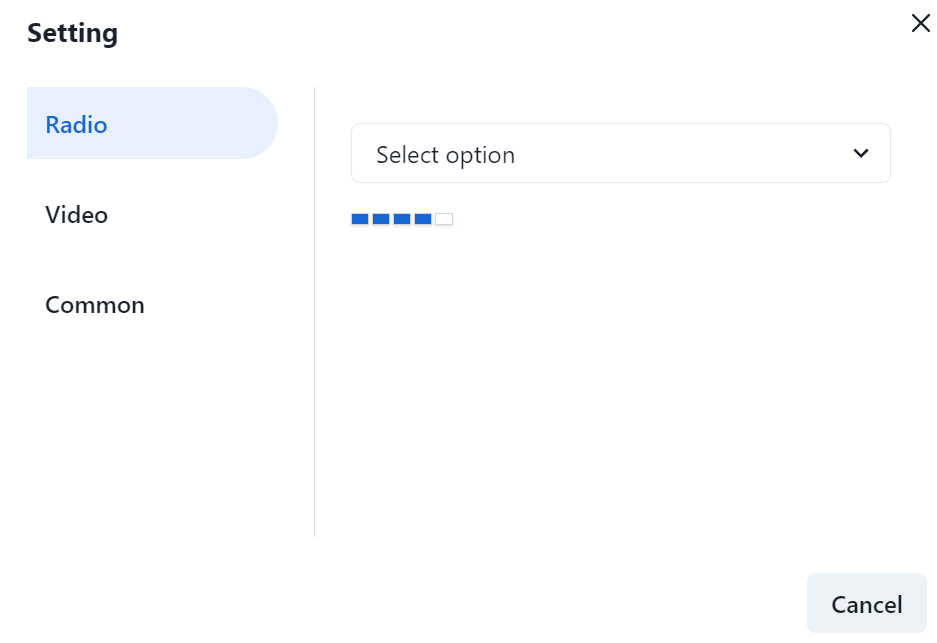

### AudioWorklet 简介

AudioWorklet 用于提供在单独线程中执行的自定义音频处理脚本，以提供非常低延迟的音频处理。

之前提议处理音频使用 audioContext.createScriptProcessor，但是它被设计成了异步的形式，随之而来的问题就是处理会出现 “延迟”。

AudioWorklet 的代码在 AudioWorkletGlobalScope 全局执行上下文中运行，使用由工作集和其他音频节点共享的单独的 Web 音频线程。

### 在 Ract 中实现监听麦克风音量大小

使用 `navigator.mediaDevices.getUserMedia` 来获取音频流。这里方便复用写成hook的形式。

* 获取到stream后，创建一个 `AudioContext`, 音频中的 `AudioContext` 可以类比于 `canvas` 中的 `context`，其中包含了一系列用来处理音频的 `API`，简而言之，就是可以用来控制音频的各种行为，比如播放、暂停、音量大小等等。

也能做一些高级的操作，比如声道的合并与分割、混响、音调、声相控制和音频振幅压缩等等。

* 创建处理器脚本，也就是下面的 `vumeterProcessor.js`，然后在脚本主文件中一个 AudioWorkletNode 实例，并传递处理器的名称，然后通过 `addModule` 将该实例连接。

> **注意点：**
> 在调用 `addModule` 时，`AudioWorklet` 需要通过网络加载，要将文件路径放到 pubilc 文件夹中。

* 然后创建 `AudioWorkletNode`，创建时传递的参数为(audioContext，‘处理脚本的名称’)，也就是 `registerProcessor('vumeter', VolumeMeter)` 与这里的一致。

* 实时监听音频的变化，设置音量。

* 最后，在不需要使用时调用 `audioContext.close()` **来进行销毁**。

### 实现代码

useMedia.ts

```js
import { useState, useEffect } from 'react';

const constraintsDefault: MediaStreamConstraints = {
  video: true,
  audio: {
    channelCount: 1, // 单声道
    noiseSuppression: true, // 降噪
    echoCancellation: true,   // 回音消除
  },
};

export const useMedia = (constraints: MediaStreamConstraints = constraintsDefault) => {
  const [stream, setStream] = useState<MediaStream | null>(null);
  const [mediaError, setMediaError] = useState<any>(null);
  const [microphoneVolume, setMicrophoneVolume] = useState(0);
  const [audioContext, setAudioContext] = useState<AudioContext>(
    () => new AudioContext()
  );

  const closeStream = async () => {
    if (stream && stream.getTracks()) {
      stream.getTracks().forEach((track: MediaStreamTrack) => {
        track.stop();
      });
    }
    setStream(null);
    await audioContext?.close();
  }

  const getMicrophoneVolume = async (mediaStream: MediaStream) => {
    /**
     * In this case the audioWorklet.addModule() method expects the path to point to your public folder. 
     * It can also be an external URL for example a link to Github repository that loads the JS file.
     * https://stackoverflow.com/questions/49972336/audioworklet-error-domexception-the-user-aborted-a-request
     */
    await audioContext?.audioWorklet.addModule('js/vumeterProcessor.js');
    const microphone = audioContext?.createMediaStreamSource(mediaStream);
    const node = new AudioWorkletNode(audioContext, 'vumeter');

    node.port.onmessage = event => {
      let volume = 0;
      if (event.data.volume) volume = Math.round(event.data.volume);
      setMicrophoneVolume(volume);
    }
    microphone?.connect(node).connect(audioContext.destination);
  }

  useEffect(() => {
    navigator.mediaDevices.getUserMedia(constraints).then(mediaStream => {
      setStream(mediaStream);
      getMicrophoneVolume(mediaStream);
    }).catch(error => {
      setMediaError(error);
    });
    // eslint-disable-next-line react-hooks/exhaustive-deps
  }, []);
  
  return {
    stream,
    mediaError,
    microphoneVolume,
    closeStream,
  };
}
```
vumeterProcessor.js

```js
// vumeterProcessor.js
const SMOOTHING_FACTOR = 0.8;

class VolumeMeter extends AudioWorkletProcessor {
  static get parameterDescriptors() {
    return [];
  }

  constructor() {
    super();
    this.volume = 0;
    this.lastUpdate = currentTime;
  }

  calculateVolume(inputs) {
    const inputChannelData = inputs[0][0];
    let sum = 0;

    // Calculate the squared-sum.
    for (let i = 0; i < inputChannelData.length; ++i) {
      sum += inputChannelData[i] * inputChannelData[i];
    }

    // Calculate the RMS level and update the volume.
    const rms = Math.sqrt(sum / inputChannelData.length);

    this.volume = Math.max(rms, this.volume * SMOOTHING_FACTOR);

    // Post a message to the node every 200ms.
    if (currentTime - this.lastUpdate > 0.2) {
      this.port.postMessage({ eventType: "volume", volume: this.volume * 100 });
      // Store previous time
      this.lastUpdate = currentTime;
    }
  }

  process(inputs, outputs, parameters) {
    this.calculateVolume(inputs);

    return true;
  }
}

registerProcessor('vumeter', VolumeMeter); // 注册一个名为 vumeter 的处理函数 注意：与主线程中的名字对应。
```

### 使用方式

```js
import { useMedia } from '@/hooks/useMedia';

const { stream, microphoneVolume, closeStream } = useMedia();
```

我们在页面中，可以加一些样式来查看效果

```js
<div className={styles.volume}>
  {
    [1, 2, 3, 4, 5].map(item => {
      return (
        <>
          <div 
            className={styles.volumeItem} 
            style={{
              backgroundColor: microphoneVolume > item ? '#1967d2' : '#fff'
            }}
          ></div>
        </>
      )
    })
  }
</div>
```
css

```css
.volume {
  margin-top: 20px;
  display: flex;
  align-items: center;
}
.volumeItem {
  width: 12px;
  height: 8px;
  border: 1px solid #d4d4d4;
  box-shadow: 0 1px 2px 0 rgba(149, 157, 163, 0.3);
  margin-right: 2px;
}
```
最后看一下预览效果



